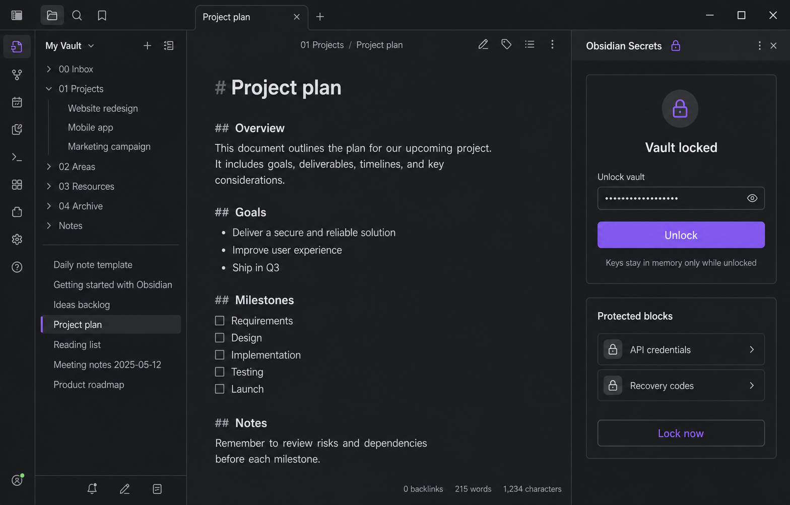

# Sidebar UI Implementation
*Last Updated: 2026-08-12 14:09:25 IST*

## Purpose
Provide a small, extensible Obsidian sidebar for the encryption workflow while keeping all security-sensitive behavior behind explicit future integrations.

## Current Slice
- `src/ui/SecretsSidebarView.ts` registers an Obsidian `ItemView` with four tabs: Vault, Blocks, History, and Settings.
- `src/main.ts` exposes the view through a ribbon icon and the `Open Obsidian Secrets sidebar` command.
- The Vault tab starts locked and renders a password field, but the submit handler clears the field and reports that unlock is not connected. It never derives, stores, or logs a key.
- Blocks, History, and Settings are honest empty/planned states. Disabled import/export controls are present only as layout affordances.
- `styles.css` provides the dark, compact sidebar styling shown in the mockup.

## Tab Responsibilities
### Vault
Show lock state, session status, explicit unlock/lock controls, and the key-policy summary.

### Blocks
List encrypted inline blocks after editor integration. Export and import must operate on ciphertext blocks and never serialize plaintext or keys.

### History
Show non-sensitive lock, unlock, import, export, and update events. Passwords, plaintext, ciphertext, and key material are prohibited.

### Settings
Host encryption-key choices, session expiry, export/import policy, and updater channel/confirmation settings as each capability becomes real.

## Security Boundaries
- The sidebar does not auto-open, auto-unlock, or initialize a vault.
- The current password input is a visual placeholder only and is cleared on submit.
- Real unlock must be owned by a session-key layer using a non-extractable, vault-scoped key with explicit lock, expiry, unload, vault-change, and mobile-background cleanup.
- UI errors must not change note content or create plaintext persistence.

## Reference Artifact

The screenshot is a design reference, not evidence that the encryption workflow is implemented.

## Next Integration Steps
1. Add session-key lifecycle state and connect the Vault tab to it.
2. Add editor transaction actions for encrypting a selected plaintext block.
3. Add Reading View lock markers and explicit short-lived reveal.
4. Replace the Blocks empty state with ciphertext-only indexing and export/import workflows.
5. Record only non-sensitive lifecycle events in History and connect real settings controls.
